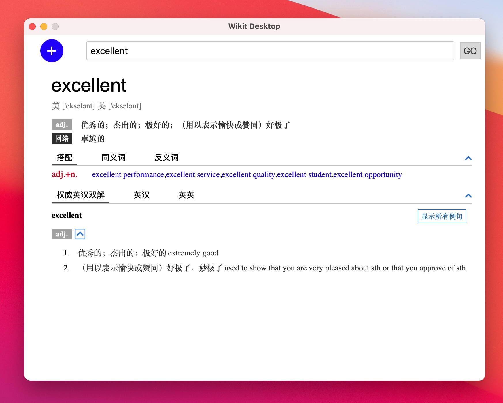

# Wikit - A universal dictionary

# What is it?

To be short, Wikit is a dictionary suite for human in [FOSS](https://en.wikipedia.org/wiki/Free_and_open-source_software) style.

So what are planned to be included? The goals of this project are to make

- **A CLI tool to deal with a variety of dictionary formats**

- **Desktop application for Windows, Linux and MacOS**

    The desktop client is developed using [tauri](https://tauri.studio/en/) and [svelte](https://svelte.dev/):

    

- **A dictionary server**

    It is usable for now, but there are many things to be improved.

# Installation and Usage

There are two tools provided by wikit, one is `Wikit Command Line` (abbreviated as wikit), the other is `Wikit Desktop`.
The former is used to create, unpack, parse dictionary, or even used as a dictionary server, the
latter is used as a dictionary client which you can lookup words from.

You can download them from [Release](https://github.com/ikey4u/wikit/releases) page.

**To use Wikit Desktop on Windows, you must additionally install [webview2](https://developer.microsoft.com/en-us/microsoft-edge/webview2/#download-section) and [vc_redist.x86](https://aka.ms/vs/17/release/vc_redist.x86.exe) or [vc_redist.x64](https://aka.ms/vs/17/release/vc_redist.x64.exe).**

## Creating dictionary

You can use wikit CLI to create wikit dictionary from text file, each word-meaning item of the text
file holds **three** lines and should follow this format

```
word
meaning
</>
```

`word` is keyword of your dictionary, it can be a single word like `cat`, `dog` or a phrase
like `a lot of`, `never mind`. If `word` is long, it should be wrapped and put in one line.

`meaning` is your explanation for your `word`, it can be any valid html content. if `meaning` is
long, it should be wrapped and put in one line. This constraint may be removed in future.

`</>` is an end marker, write it in a single line

Here is an example

```
cat
<div class="meaning"> <h2>cat</h2> cat is an animal </div>
</>

dog
<div class="meaning"> <h2>dog</h2> dog is an animal </div>
</>
```

Let's assume the content above is saved as a file `/path/to/dict/dict.txt`, then 
you can run the following command to create wikit dictionary

    wikit dict --create -o dict.wikit /path/to/dict/dict.txt

wikit also supports css style and javascript to decorate your `meaning`, you can organize your
dictionary related files as below

    dict/
    +-- dict.txt
    +-- dict.css
    +-- dict.js
    +-- dict.toml

As you can see, your css and js file name must be the same with your dictionary source file.
The `dict.toml` file is used to provid some basic information for your dictionary, here is an example

    name = "wikit example dictionary"

    desc = '''
    This is just a wikit example dictionary, nothing more.
    '''

    author = "wikit author"

`dict.css`, `dict.js` and `dict.toml` are all optional, provide only when you need them.

A full example can be found at [wikit/examples/dict](https://github.com/ikey4u/wikit/tree/master/examples/dict).

What's more, wikit also support you create wikit dictionary directly from MDX file as below

    wikit dict --create -o /path/to/dict.wikit /path/to/dict.mdx

## Configuring dictionary

Let's assume you have a wikit dictionary located at `/path/to/dict.wikit`, you should create a
configuration file in the following location

```
macos: ${HOME}/Library/Application Support/wikit/wikit.toml
linux: ${HOME}/.config/wikit/wikit.toml
windows: C:\Users\YOUNAME\AppData\Roaming\wikit\wikit.toml
```

The content of `wikit.toml` looks like

```
[cltcfg]                          
uris = [                          
    "file:///path/to/dict.wikit", 
]                                 
                                  
[srvcfg]                          
uris = [                          
]                                 
host = "0.0.0.0"                  
port = 8888
```

If you use wikit desktop, you should focus on the section `[cltcfg]` and do not touch `[srvcfg]` section.

`uris` can be path to your wikit dictionary (the path must begin with `file://`) or API address (must
starts with http or https) that your wikit server provides, such as `http://192.168.1.8:8888`.
The API address should be IP address for now, domain support will be added in future.

If run wikit as as a dictionary server, you should focus on `[srvcfg]` section.
`uris` are the same as `[cltcfg]`, `host` and `port` will be the address your dictionary server
listens to.

## Using dictionary

Everything is done, open `Wikit Desktop` and start to lookup.

If you add, delete or change the wikit dictionary, remember to restart `Wikit Desktop`.

# Developement

Install tauri-cli

    cargo install --git https://github.com/tauri-apps/tauri --tag cli.rs-v1.0.0-rc.6 tauri-cli 

and check the version

    cargo tauri --version

Start web server using

    npm run dev

In a new terminal, build the app

    cargo tauri dev

# Building

To build wikit command line

    cd cli
    cargo build --release

To build wikit desktop

    cd desktop
    npm i
    npm run build
    cargo install tauri-cli --version "^1.0.0-beta"

    cargo tauri build

You can find the generated files in `target/release`.

# License

[MIT](./LICENSE)
