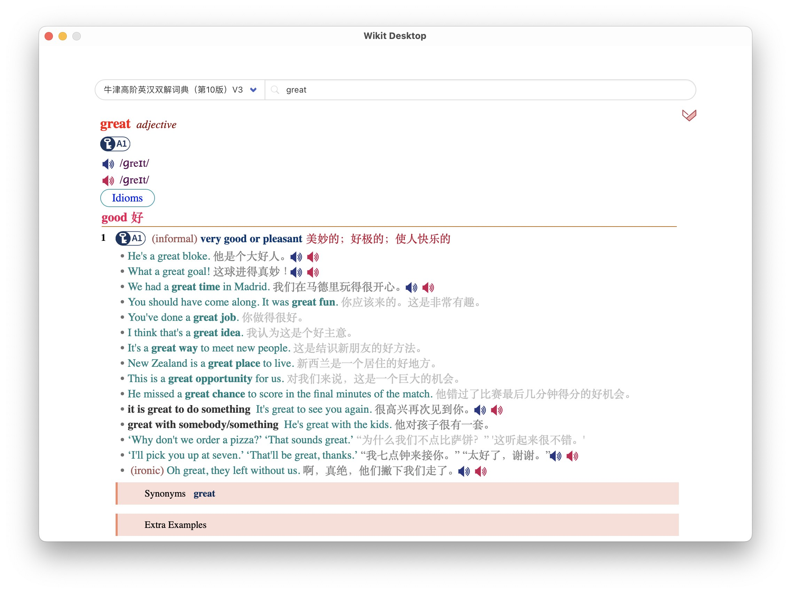

# Wikit - A universal dictionary

Wikit is a free and open-source dictionary program that enable you translate word for different
languages. It contains the following components

- Wikit CLI: A CLI tool which can create from plain text other format into wikit dictionary

- Wikit Desktop: Desktop application for Windows, Linux and MacOS

    The desktop client is developed using [tauri](https://tauri.studio/en/) and [yew](https://yew.rs/).

    

- Wikit Server: A dictionary server

    Has been developed but not available to the public for the time being.

- Wikit Mobile: Mobile application for Android

    It's under planning.

# Installation and Usage

You can download Wikit CLI and Wikit Desktop from [Release](https://github.com/ikey4u/wikit/releases) page.

To install dictionary, see [Wikit Introduction](https://github.com/ikey4u/wikit/wiki) for detail.

For Linux user, you can create a file in path `~/.local/share/applications/com.zhqli.wikit.desktop`
(if the path does not exist, create it) with the following content (you must change `Path` and  `Exec` to your own):

    #!/usr/bin/env xdg-open

    [Desktop Entry]
    Name=Wikit Desktop
    Comment=A universal dictionary
    Path=/path/to/wikit
    Exec=/path/to/wikit/wikit-desktop.AppImage 
    Terminal=false
    Type=Application
    Categories=Utility;
    Keywords=dictionary;dict;

And run `update-desktop-database`, after that you can open wikit desktop from your dash.

    update-desktop-database ~/.local/share/applications

**For Windows user, you must additionally install [webview2](https://developer.microsoft.com/en-us/microsoft-edge/webview2/#download-section) and [vc_redist.x86](https://aka.ms/vs/17/release/vc_redist.x86.exe) or [vc_redist.x64](https://aka.ms/vs/17/release/vc_redist.x64.exe).**

# Developement

Install dependencies following the [tauri guide](https://tauri.app/v1/guides/getting-started/prerequisites/), then install tauri-cli

    cargo install --version 1.2.2 tauri-cli
    cargo install trunk

and check the version

    cargo tauri --version

Create a file named `.env` under directory `desktop/ui` with content

    BROWSER=none
    PORT=8080

Start developent using the following command in `desktop/tauri` directory

    cargo tauri dev

# Building

To build wikit command line

    cd cli
    cargo build --release

To build wikit desktop

    cd desktop
    cargo tauri build

You can find the generated files in `target/release`.

# License

[MIT](./LICENSE)
