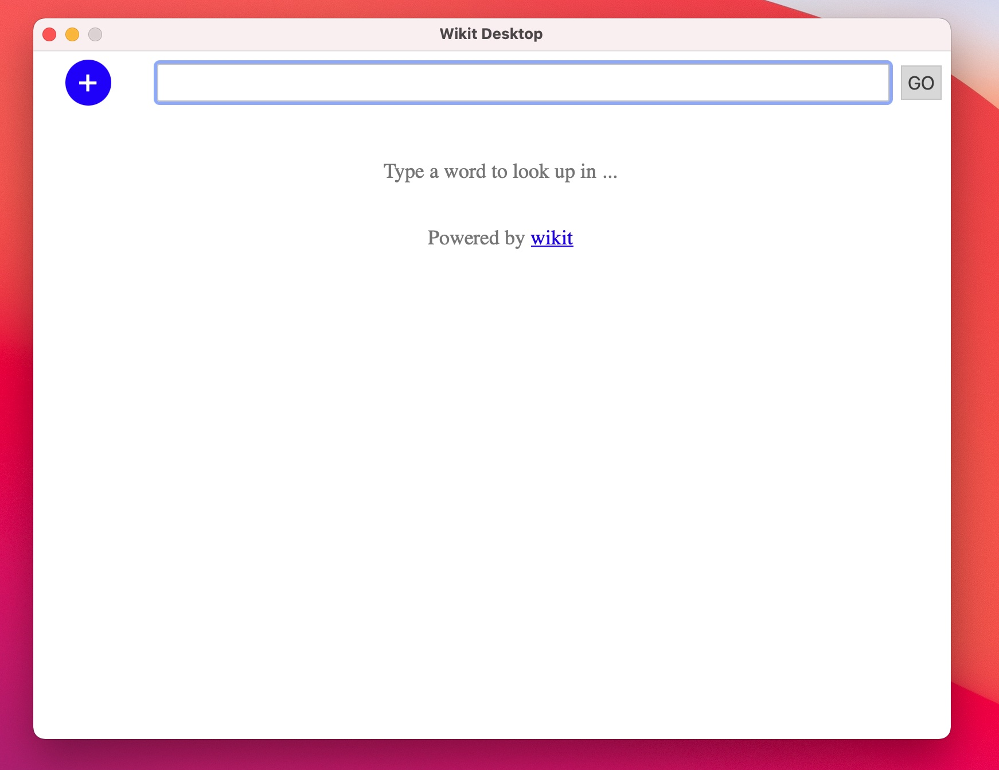

# Wikit - A universal dictionary

# What is it?

To be short, Wikit is a dictionary suite for human in [FOSS](https://en.wikipedia.org/wiki/Free_and_open-source_software) style.

So what are planned to be included? The goal of this project is to make

- **A CLI tool to deal with a variety of dictionary formats**

    Currently it supports the follwing dictionary format

    - wikit

        It is wikit's own format, fully opensourced and powered by the awesome [FST](https://github.com/BurntSushi/fst) index algorithm

        Wikit CLI can create wikit dictionary from MDX or text.

    - MDX

        It is a very popular close sourced dictionary format, but the format is almost disclosed by
        reversing engineer. There are many tools invented to create, parse or unpack MDX dictionary,
        and the implemention is variable which may cause compatibility problems.

        Wikit CLI can create MDX from text and unpack MDX into text. It is not recommended that you
        use Wikit CLI to create MDX dictionary and used in another dictionary client since there
        may exist compatibility problem.

    - MacOS dictionary (create from mdx, text)

        Close sourced dictionary format provided by Apple, but apple provides toolkit to create
        this type dictionary. Wikit CLI just use that toolkit to create macos dictionary from text
        or mdx.

- **Desktop application for Windows, Linux and MacOS**

- **A dictionary server**

# What is the project status?

- CLI TOOL/**Done**

    See its usage in `Installation and Usage` section.

- DESKTOP APPLICATION/**Beta Done**

    It is developed based on [tauri](https://tauri.studio/en/) and [svelte](https://svelte.dev/),
    and here are some snapshots

    - the main ui

        

    - the lookup ui

        

- DICTIONARY SERVER/**Beta Done**

    It is usable for now, but there are many things to be improved.

# Installation and Usage

There are two tools provided by wikit, one is `Wikit Command Line` (abbreviated as wikit), the other is `Wikit Desktop`.
The former is used to create, unpack, parse dictionary, or even used as a dictionary server, the
latter is used as a dictionary client which you can lookup words from.

## Wikit Command Line

Download the tool from [release](https://github.com/ikey4u/wikit/releases) page, decompress the
release packege and just fireup the tool `wikit`, you will see detail help information, for example

    wikit 0.3.0
    ikey4u <pwnkeeper@gmail.com>
    A universal dictionary - Wikit

    USAGE:
        wikit [SUBCOMMAND]

    FLAGS:
        -h, --help       Prints help information
        -V, --version    Prints version information

    SUBCOMMANDS:
        dict      Process dictionary file
        help      Prints this message or the help of the given subcommand(s)
        server    Run wikit as an API server

You can see more detail help for subcommand, for example you can use the following command
to see the help of subcommand `dict`:

    wikit dict

An example output is showed below

    Process dictionary file

    USAGE:
        wikit dict [FLAGS] [OPTIONS] <input>

    FLAGS:
        -c, --create     Create dictionary file
        -h, --help       Prints help information
            --info       Dump basic information of dictionary file
        -V, --version    Prints version information

    OPTIONS:
        -o, --output <output>    Same with <input>
            --table <table>      The table name in the database, you must provide this parameter if input/output is a
                                 database url

    ARGS:
        <input>    The input file format depends on the value. File suffix reflects the format, for example .txt =>
                   text, .mdx => mdx, .wikit => wikit, .dictionary => macos dictionary. If the value is a database url
                   such as postgresql://user@localhost:5432/dictdb, then the input is a database

## Wikit Desktop

The desktop client use `wikit.toml` as its configuration, it can be find by click menu `Wikit Desktop/Open Configuration Directory`.
The content of this file looks like

    [cltcfg]
    uris = [
        "file:///path/to/dict.wikit",
    ]

    [srvcfg]
    uris = [
    ]
    host = "0.0.0.0"
    port = 8888

Please see [wiki page](https://github.com/ikey4u/wikit/wiki/Wikit-Configuration) for more detail.

# MDX Dictionary Compatibility

The first-class citizens supported by Wikit are opensourced dictionary tools such as
[goldendict](https://github.com/goldendict/goldendict). As a result, MDX created by Wikit will
mainly be tested for them. Currently, MDX is tested with goldendict version 1.5.0-RC2+git, it works
really well. If you have any other problems with the created MDX, please file an issue. MDX created
by wikit is also tested with [MDict](https://www.mdict.cn) version 2.0.12, it works but the
dictionary index seems does not work well.

# Building

- Build for your development machine

        cargo build

- Build cross-platform (mac, win, linux)

    Ensure [docker](https://www.docker.com/) is installed and then

    - make development container

            make image
            make container

    - build packages

            make publish

    The generated packages will be found in `release/` directory.

# License

[MIT](./LICENSE)
