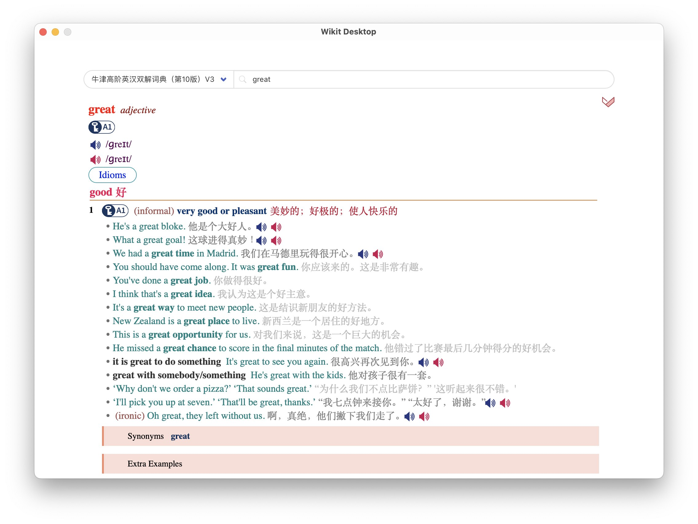

  

  Wikit is a free and open-source dictionary program that enable you translate word for different languages

wikit contains the following components

- Wikit CLI

    A CLI tool which can be used to create wikit dictionary from plain text or other dictionary format.

- Wikit Desktop

    Desktop application for Windows, Linux and MacOS built with Electron and a Rust NAPI native module.

    

- Wikit Mobile

    Mobile application for Android, it's under planning.

# Installation and Usage

You can download Wikit CLI and Wikit Desktop from [Release](https://github.com/ikey4u/wikit/releases) page.

To install dictionary, see [Wikit Introduction](https://github.com/ikey4u/wikit/wiki) for detail.

For Linux user, you can create a file in path `~/.local/share/applications/com.zhqli.wikit.desktop`
(create if the path does not exist) with the following content:

    #!/usr/bin/env xdg-open

    [Desktop Entry]
    Name=Wikit Desktop
    Comment=A universal dictionary
    Path=/path/to/wikit
    Exec=/path/to/wikit/wikit-desktop.AppImage 
    Terminal=false
    Type=Application
    Categories=Utility;
    Keywords=dictionary;dict;

You should change `Path` and  `Exec` to your own, and run `update-desktop-database`

    update-desktop-database ~/.local/share/applications

after that you can open wikit desktop from your dash.                               

If you are bother with the manual installation on linux, you can install it from
[flathub](https://flathub.org/apps/details/com.zhqli.wikit).

# Developement

To develop wikit CLI

    cd cli
    cargo build

To develop wikit desktop

    cd desktop/electron
    npm install
    npm start

To develop wikit mobile

    cd android
    make start

# Building

To build wikit CLI

    cd cli
    cargo build --release

To build wikit desktop

    cd desktop/electron
    npm install
    npm run dist

To build wikit mobile

    cd android
    make release

# License

[MIT](./LICENSE)
